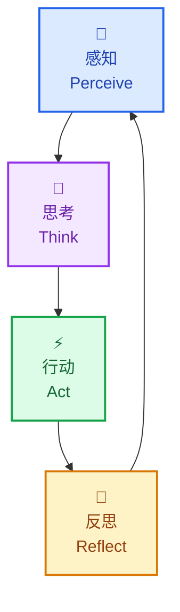
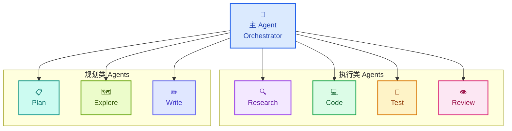
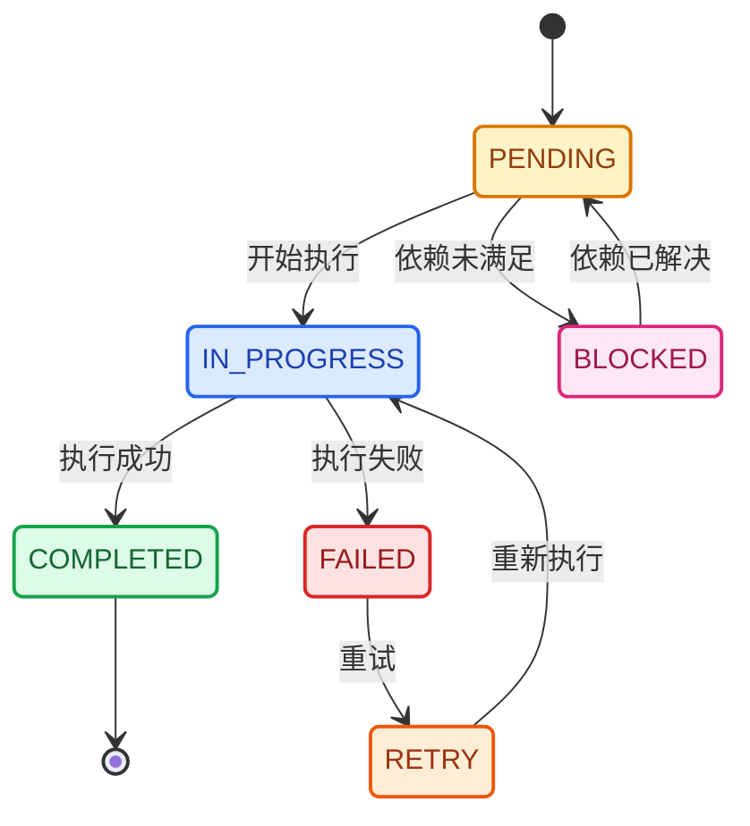
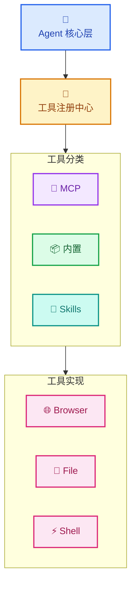
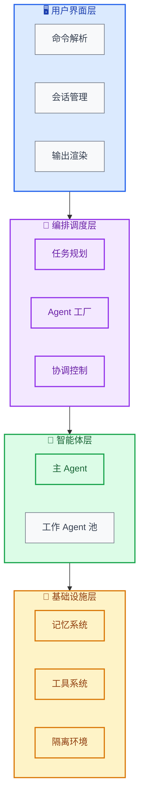

# Niuma 🐂

**下一代认知多智能体 AI 系统**

Niuma（牛马）是一个具备**认知能力**、**协作能力**和**自主执行能力**的 AI Agent 系统，能够处理复杂的多步骤任务，通过多智能体协作和反思机制持续优化执行质量。

<svg xmlns="http://www.w3.org/2000/svg" shape-rendering="geometricPrecision" text-rendering="geometricPrecision" image-rendering="optimizeQuality" fill-rule="evenodd" clip-rule="evenodd" viewBox="0 0 512 330.97" width="200"><path fill="#DE9800" fill-rule="nonzero" d="M27.55 0h456.89c7.56 0 14.45 3.12 19.44 8.1 5.01 5 8.12 11.9 8.12 19.45v175.97c0 7.54-3.12 14.44-8.12 19.44-4.99 4.99-11.89 8.11-19.44 8.11H27.55c-7.55 0-14.45-3.11-19.45-8.1l-.19-.22C3.04 217.78 0 210.98 0 203.52V27.55C0 19.99 3.1 13.1 8.09 8.11 13.1 3.09 19.99 0 27.55 0z"/><path fill="#fff" fill-rule="nonzero" d="M484.44 6.62H27.55c-5.76 0-11 2.35-14.78 6.13-3.8 3.8-6.15 9.04-6.15 14.8v175.97c0 5.66 2.29 10.83 5.98 14.6l.18.17c3.8 3.8 9.05 6.17 14.77 6.17h456.89c5.72 0 10.96-2.38 14.76-6.18 3.81-3.8 6.18-9.04 6.18-14.76V27.55c0-5.72-2.37-10.97-6.17-14.77-3.78-3.79-9.02-6.16-14.77-6.16z"/><path fill="#FFB206" fill-rule="nonzero" d="M484.44 6.62h-35.08L260.6 224.46h83.71L505.38 39.57V27.55c0-5.72-2.37-10.97-6.17-14.77-3.78-3.79-9.02-6.16-14.77-6.16zm-94.9 0h-73.38L126.91 224.46h71.87L314.5 91.63l75.04-85.01zm-139.98 0h-84.75L6.62 188.2v15.32c0 5.66 2.29 10.83 5.98 14.6l.18.17c3.8 3.8 9.05 6.17 14.77 6.17h32.23L249.56 6.62zm-145.28 0H27.55c-5.76 0-11 2.35-14.78 6.13-3.8 3.8-6.15 9.04-6.15 14.8v91.16L104.28 6.62zm307.16 217.84h73c5.72 0 10.96-2.38 14.76-6.18 3.81-3.8 6.18-9.04 6.18-14.76v-86.88l-93.94 107.82z"/><path fill="#1A1A1A" d="M65.05 317.58h26.43v-86.47h39.28v86.47h26.43v13.39H65.05zm269.29 0h26.42v-86.52h39.28v86.52h26.43v13.39h-92.13z"/><path fill="#DE9800" fill-rule="nonzero" d="M50.96 22.23h410.08c7.39 0 14.11 3.05 18.99 7.92 4.9 4.9 7.94 11.65 7.94 19.01v132.76c0 7.34-3.06 14.09-7.95 18.97-4.88 4.89-11.63 7.95-18.98 7.95H50.96c-7.37 0-14.11-3.04-19-7.93-4.88-4.87-7.93-11.61-7.93-18.99V49.16c0-7.39 3.04-14.14 7.91-19.01 4.88-4.89 11.61-7.92 19.02-7.92z"/><path fill="#fff" d="M50.96 25.23h410.08c13.16 0 23.93 10.88 23.93 23.93v132.76c0 13.05-10.88 23.92-23.93 23.92H50.96c-13.05 0-23.93-10.76-23.93-23.92V49.16c0-13.16 10.77-23.93 23.93-23.93z"/><path d="M384.11 56.55c4.35 0 7.87 3.52 7.87 7.86s-3.52 7.86-7.87 7.86c-4.33 0-7.86-3.52-7.86-7.86s3.53-7.86 7.86-7.86zm8.96 58.83c1.32-2.03 2.82-4.03 4.78-6.16l.58-.6-20.27-8.42 5.32 8.41c.44.69.62 1.46.58 2.22l-.61 14.14-7.62-.36.55-12.94-7.45-11.81-5.64 24.13-7.82-.29 7.12-30.39-18.04-7.91 1.12-6 7.21 3.07 4.05-7.14a3.829 3.829 0 0 1 2.67-1.88v-.01l11.31-1.94c.82-.14 1.61-.02 2.31.32l13.88 5.91c1.19.51 1.98 1.55 2.24 2.71l4.17 19.14c.06.3.09.61.09.9l9.22 3.54 7.05-7.39.08-.03.11-.03c6.85-1.68 12.69 18.08 13.84 22.79l.11.45c.85 3.48 1.22 5.01.53 5.71-.55.55-1.69.51-3.73.46-.93-.03-2.07-.07-3.43-.05-4.27.05-8.48.05-12.61-.03-4.14-.06-8.18-.18-12.14-.37-.97-.05-1.78-.05-2.42-.06-1.21-.01-1.87-.02-2.14-.31-.58-.66 3.8-7.91 5-9.78zm-23.71-35.86-4.05 8.46-5.42-2.41 2.78-4.9 6.69-1.15zM379.4 94.2l3.26-8.53 2.4 11.03-5.66-2.5z"/><path fill-rule="nonzero" d="M97.63 120.44c-2.71 0-5.16-.25-7.35-.72-2.22-.48-4.19-1.22-5.88-2.2-7.37-4.27-9.54-12.21-9.54-20.26l.15-30.75h15.27l-.14 29.25c-.01 1.7.06 3.23.21 4.55.21 1.78.62 3.85 1.69 5.32 1.88 2.57 6.95 2.68 9.48 1.16 2.05-1.24 2.71-4.39 2.95-6.57.16-1.28.23-2.78.23-4.46V66.51h15.22v30.96c0 9.15-3.09 18.11-12.37 21.45-2.8 1.01-6.12 1.52-9.92 1.52zm310.91 53.66v-33.85h7.92l11.57 18.59 4.33 9.11h-1.55l-1.36-12.8v-14.9h7.69v33.85h-8.52l-10.97-18.13-4.97-10.39h1.87l1.69 13.9v14.62h-7.7zM74.86 157.24c0-2.87.45-5.38 1.33-7.55.88-2.16 2.11-3.97 3.68-5.43 1.58-1.46 3.42-2.55 5.52-3.28 2.1-.73 4.36-1.09 6.78-1.09 1.57 0 2.88.08 3.94.25 1.06.18 1.97.37 2.73.59.77.21 1.49.39 2.17.52l-1.09 7.29a16 16 0 0 0-1.35-.79c-.59-.31-1.34-.58-2.28-.82-.93-.23-2.08-.35-3.43-.35-1.73 0-3.3.39-4.69 1.17-1.4.79-2.51 1.93-3.33 3.45-.82 1.51-1.23 3.36-1.23 5.54 0 2.24.37 4.19 1.09 5.86.72 1.67 1.79 2.97 3.22 3.9 1.43.93 3.19 1.41 5.31 1.41.95 0 1.92-.13 2.91-.36.99-.24 1.87-.52 2.67-.85.78-.33 1.37-.66 1.75-.98v6.97c-.58.24-1.25.5-2.03.78-.79.27-1.7.5-2.73.7-1.04.2-2.21.3-3.53.3-3.74 0-6.9-.71-9.49-2.12-2.59-1.42-4.55-3.41-5.9-6-1.34-2.57-2.02-5.61-2.02-9.11zm45.02 17.23c-3.35.06-6.19-.63-8.55-2.05-2.37-1.42-4.16-3.44-5.38-6.08-1.22-2.63-1.8-5.74-1.75-9.32.08-4.01.83-7.26 2.23-9.74 1.4-2.49 3.32-4.32 5.75-5.49 2.43-1.18 5.21-1.81 8.33-1.9 3.21-.09 5.96.55 8.25 1.94s4.05 3.39 5.25 6.01c1.21 2.61 1.78 5.7 1.72 9.27-.08 4.01-.79 7.28-2.14 9.82-1.35 2.53-3.2 4.41-5.56 5.62-2.35 1.22-5.07 1.85-8.15 1.92zm.14-6.11c2.18 0 3.9-.88 5.16-2.66 1.26-1.77 1.89-4.71 1.89-8.82 0-2.13-.24-3.99-.73-5.6-.48-1.61-1.21-2.87-2.2-3.76-.99-.9-2.24-1.35-3.76-1.35-1.38 0-2.64.35-3.78 1.03-1.14.68-2.05 1.83-2.72 3.44-.68 1.61-1.02 3.81-1.02 6.6 0 2.16.27 4.08.8 5.74.53 1.68 1.33 2.99 2.39 3.95 1.05.95 2.37 1.43 3.97 1.43zm21.27 5.74v-33.85h7.93l11.57 18.59 4.32 9.11h-1.54l-1.37-12.8v-14.9h7.7v33.85h-8.52l-10.98-18.13-4.97-10.39h1.87l1.69 13.9v14.62h-7.7zm45.47.37c-1.61 0-3.15-.12-4.61-.36-1.47-.24-2.75-.52-3.82-.84-1.08-.33-1.84-.63-2.28-.9l1.05-6.6c.56.31 1.32.64 2.27.98.96.33 2.02.61 3.19.84 1.16.24 2.33.36 3.51.36 1.6 0 2.76-.23 3.48-.68.72-.46 1.08-1.19 1.08-2.19 0-.73-.22-1.35-.66-1.86-.44-.51-1.16-1.02-2.17-1.55s-2.37-1.21-4.05-2.01c-1.43-.68-2.74-1.5-3.94-2.43a11.02 11.02 0 0 1-2.9-3.37c-.72-1.32-1.09-2.87-1.09-4.68 0-1.55.3-2.91.88-4.07a7.899 7.899 0 0 1 2.49-2.9c1.06-.77 2.34-1.36 3.81-1.75 1.47-.38 3.1-.57 4.9-.57 2.54 0 4.63.23 6.24.7 1.61.47 2.72.89 3.32 1.26l-1.32 6.33c-.68-.53-1.73-1.03-3.15-1.48a14.68 14.68 0 0 0-4.36-.66c-1.07 0-1.94.11-2.62.35-.69.23-1.2.56-1.53.99-.33.43-.5.92-.5 1.48 0 .68.2 1.29.6 1.81.4.53 1.03 1.04 1.89 1.55.86.51 1.97 1.07 3.34 1.7a36.3 36.3 0 0 1 3.91 2.01c1.15.68 2.12 1.42 2.92 2.23.81.8 1.42 1.71 1.84 2.74.42 1.02.62 2.21.62 3.54 0 2.02-.47 3.79-1.42 5.29s-2.34 2.66-4.18 3.49c-1.84.83-4.09 1.25-6.74 1.25zm23.73-.37v-27.33h-9.02v-6.52h26.61v6.52h-9.02v27.33h-8.57zm30.34 0h-8.47v-33.85h2.91c1.22 0 2.62-.06 4.21-.18 1.59-.12 3.59-.18 6-.18 1.49 0 2.98.16 4.46.48 1.49.33 2.85.89 4.08 1.69 1.23.79 2.22 1.9 2.96 3.29.75 1.4 1.12 3.16 1.12 5.29 0 2.31-.38 4.21-1.15 5.7-.77 1.5-1.83 2.65-3.18 3.47-.33.19-.68.38-1.04.55.44.34.85.76 1.21 1.26.63.86 1.21 1.86 1.74 2.99.52 1.13 1.04 2.31 1.55 3.53.52 1.23 1.1 2.39 1.74 3.5.22.41.46.82.7 1.23.25.41.48.82.71 1.23h-9.34a4.93 4.93 0 0 1-.51-.83c-.16-.33-.4-.86-.72-1.58-.46-1.02-.87-2.09-1.23-3.21-.37-1.11-.73-2.15-1.11-3.13-.37-.97-.8-1.77-1.28-2.38-.45-.56-.99-.87-1.62-.93-.95.06-2.19.08-3.74.08v11.98zm0-17.86c.3.05.72.09 1.23.12.52.03 1.04.04 1.58.05.53 0 .97.01 1.34.01 1.73 0 2.99-.55 3.78-1.65.79-1.1 1.18-2.43 1.18-3.99 0-.84-.14-1.64-.43-2.39-.3-.75-.85-1.36-1.65-1.83-.79-.47-1.94-.7-3.43-.7-.61 0-1.22.03-1.85.09-.63.07-1.22.18-1.75.32v9.97zm37.73 18.23c-3.5 0-6.29-.61-8.39-1.83-2.09-1.21-3.6-2.91-4.53-5.1-.93-2.19-1.39-4.74-1.39-7.65l.09-19.64h8.43l-.09 18.63c-.02 2.37.2 4.2.63 5.48.43 1.28 1.08 2.17 1.94 2.67.85.49 1.91.74 3.17.74 1.28 0 2.34-.26 3.19-.77.85-.52 1.49-1.43 1.91-2.72.43-1.29.64-3.09.64-5.4v-18.63h8.38v19.77c0 4.53-1.11 8.07-3.33 10.62-2.23 2.55-5.78 3.83-10.65 3.83zm18.9-17.23c0-2.87.44-5.38 1.32-7.55.88-2.16 2.11-3.97 3.69-5.43 1.58-1.46 3.42-2.55 5.51-3.28 2.1-.73 4.36-1.09 6.79-1.09 1.57 0 2.88.08 3.94.25 1.05.18 1.96.37 2.73.59.77.21 1.49.39 2.17.52l-1.09 7.29c-.32-.21-.77-.48-1.35-.79-.59-.31-1.34-.58-2.28-.82-.93-.23-2.08-.35-3.43-.35-1.73 0-3.3.39-4.69 1.17-1.4.79-2.51 1.93-3.33 3.45-.82 1.51-1.23 3.36-1.23 5.54 0 2.24.36 4.19 1.09 5.86.72 1.67 1.79 2.97 3.22 3.9 1.42.93 3.19 1.41 5.31 1.41.95 0 1.92-.13 2.91-.36.99-.24 1.87-.52 2.66-.85.79-.33 1.38-.66 1.76-.98v6.97c-.58.24-1.26.5-2.04.78-.78.27-1.69.5-2.72.7-1.04.2-2.22.3-3.53.3-3.74 0-6.9-.71-9.49-2.12-2.59-1.42-4.55-3.41-5.9-6-1.34-2.57-2.02-5.61-2.02-9.11zm37.09 16.86v-27.33h-9.02v-6.52h26.61v6.52h-9.03v27.33h-8.56zm22.32 0v-33.85h8.57v33.85h-8.57zm30.25.37c-3.34.06-6.19-.63-8.55-2.05-2.36-1.42-4.15-3.44-5.37-6.08-1.23-2.63-1.81-5.74-1.75-9.32.08-4.01.82-7.26 2.22-9.74 1.41-2.49 3.32-4.32 5.75-5.49 2.43-1.18 5.21-1.81 8.34-1.9 3.2-.09 5.95.55 8.25 1.94 2.29 1.39 4.04 3.39 5.25 6.01 1.21 2.61 1.77 5.7 1.72 9.27-.08 4.01-.8 7.28-2.14 9.82-1.36 2.53-3.21 4.41-5.56 5.62-2.36 1.22-5.08 1.85-8.16 1.92zm.14-6.11c2.19 0 3.91-.88 5.17-2.66 1.26-1.77 1.89-4.71 1.89-8.82 0-2.13-.24-3.99-.73-5.6-.49-1.61-1.22-2.87-2.21-3.76-.98-.9-2.24-1.35-3.76-1.35-1.38 0-2.64.35-3.78 1.03-1.14.68-2.04 1.83-2.72 3.44-.67 1.61-1.01 3.81-1.01 6.6 0 2.16.26 4.08.79 5.74.54 1.68 1.33 2.99 2.39 3.95 1.05.95 2.37 1.43 3.97 1.43zm-258.81-49.79V66.51h13.94c5.17 8.38 14.01 20.65 17.97 28.96-1.04-9.71-.56-19.15-.56-28.96h14.18v53.38h-14.83c-5.1-8.37-13.1-19.97-17.12-28.39 1.16 9.62.61 18.56.61 28.39h-14.19v-1.32zm55.03 0V66.51c6.71 0 13.21-.45 19.88-.55 9 0 15.63 2.3 19.9 6.88 2.12 2.27 3.73 5.04 4.79 8.26 1.04 3.16 1.57 6.78 1.57 10.83 0 2.95-.26 5.72-.79 8.27-2.04 9.97-8.33 17.14-18.39 19.42-2.4.55-5.01.82-7.82.81-3.44-.11-6.85-.29-10.3-.48l-8.84-.06v-1.32zm15.41-10.41c1.55.18 2.94.25 4.5.28 6.29-.03 9.2-4.62 10.07-10.36.6-4.12.52-10.42-.91-14.36-1.66-4.54-5.03-5.97-9.65-5.97-1.38.04-2.64.14-4.01.29v30.12zm37.57 10.41V66.51h34.73v12.13h-19.45v8.08h15.02v11.86h-15.02v8.97h21.44v12.34h-36.72v-1.32zm57.3 1.32h-14.02V66.51l8.57-.07 7.42-.41 5-.07c2.31 0 4.65.25 6.97.76 6.39 1.39 11.42 5.44 12.82 12.03.29 1.43.45 2.97.45 4.65 0 3.66-.63 6.71-1.87 9.14-.64 1.24-1.39 2.34-2.26 3.28-.87.94-1.89 1.77-3.01 2.45l.65.8c.99 1.37 1.91 2.95 2.73 4.72l3.55 7.95c1.47 2.76 3.02 5.44 4.58 8.15h-16.9c-1.59-1.92-2.48-4.52-3.43-6.8l-2.53-7.19-.83-1.81-.9-1.39c-.25-.31-.51-.55-.79-.69l-.64-.2-4.24.1v17.98h-1.32zm1.32-29.28c1.65.11 3.25.13 4.9.14 3.08-.01 4.85-1.3 5.73-4.26.53-1.83.52-4.18-.18-5.98-1-2.52-4-2.96-6.38-2.96-1.31.03-2.78.08-4.07.36v12.7z"/></svg>

## 核心特性

- 🧠 **深度认知**：CoT + Reflection 双循环，持续自我改进
- 🤝 **智能协作**：动态 Agent 组建，自适应任务分配
- 💾 **分层记忆**：短期/长期记忆协同，经验持续积累
- 🏝️ **任务隔离**：Worktree 级隔离，安全并发执行
- 🧩 **MCP 原生**：拥抱 MCP 生态，工具即插即用
- ⚡ **异步优先**：Python asyncio 全异步架构，高效资源利用

## 核心功能模块

### 认知架构 (Cognitive Architecture)



#### 思维链 (Chain-of-Thought)

- **任务分解**：LLM 分析用户输入，拆分为原子操作
- **依赖分析**：识别子任务间的执行顺序和依赖关系
- **执行规划**：生成带优先级的执行计划

#### 反思机制 (Reflection)

- **状态评估**：每步执行后评估是否接近目标
- **偏差检测**：检测执行路径是否偏离预期
- **策略调整**：根据反馈动态调整后续计划

### 多智能体协作系统



#### 团队协议 (Team Protocol)

```python
from dataclasses import dataclass
from typing import List, Literal

@dataclass
class AgentRole:
    name: str
    responsibilities: List[str]
    skills: List[str]
    constraints: List[str]

@dataclass
class CommunicationConfig:
    protocol: Literal['message_queue', 'direct', 'broadcast']
    priority_levels: int = 3

@dataclass
class CollaborationConfig:
    mode: Literal['sequential', 'parallel', 'hybrid']
    max_agents: int = 5

@dataclass
class TeamProtocol:
    roles: List[AgentRole]
    communication: CommunicationConfig
    collaboration: CollaborationConfig
```

#### 子 Agent 类型

| Agent 类型        | 职责                     | 专长领域                     |
| ----------------- | ------------------------ | ---------------------------- |
| **ResearchAgent** | 信息收集、搜索、文档阅读 | 网页搜索、代码搜索、文档解析 |
| **PlanAgent**     | 任务规划、架构设计       | 系统设计、依赖分析           |
| **CodeAgent**     | 代码编写、重构           | 代码生成、代码修改           |
| **TestAgent**     | 测试执行、验证           | 单元测试、集成测试、性能测试 |
| **ReviewAgent**   | 代码审查、质量检查       | 静态分析、最佳实践检查       |
| **ExploreAgent**  | 代码库探索、理解         | 文件搜索、依赖分析           |

### 任务系统与规划

#### 任务模型

```python
from dataclasses import dataclass, field
from typing import Optional, List, Dict, Any
from datetime import datetime
from enum import Enum, auto

class TaskStatus(Enum):
    PENDING = auto()
    IN_PROGRESS = auto()
    COMPLETED = auto()
    FAILED = auto()
    BLOCKED = auto()

class TaskType(Enum):
    ATOMIC = auto()
    COMPOSITE = auto()
    SUBTASK = auto()

@dataclass
class Task:
    id: str
    type: TaskType
    status: TaskStatus = TaskStatus.PENDING

    # 执行内容
    description: str = ""
    goal: str = ""
    acceptance_criteria: List[str] = field(default_factory=list)

    # 层级关系
    parent_id: Optional[str] = None
    subtask_ids: List[str] = field(default_factory=list)
    dependencies: List[str] = field(default_factory=list)  # 前置任务ID

    # 执行配置
    assigned_to: Optional[str] = None  # Agent ID
    tools: List[str] = field(default_factory=list)
    timeout: int = 300  # 秒
    max_retries: int = 3

    # 元数据
    priority: int = 1
    created_at: datetime = field(default_factory=datetime.now)
    started_at: Optional[datetime] = None
    completed_at: Optional[datetime] = None
    metadata: Dict[str, Any] = field(default_factory=dict)
```

#### 任务状态流转



#### 并发控制

- **后台任务**：支持长时间运行的异步任务
- **任务隔离**：每个任务在独立的 Worktree/上下文中执行
- **资源限制**：控制并发 Agent 数量，防止资源耗尽

### 记忆系统


#### 短期记忆管理

- **滑动窗口**：维护最近 N 轮对话/操作
- **智能压缩**：使用 LLM 总结历史上下文
- **重要性标记**：标记关键信息，优先保留

#### 长期记忆存储

- **向量存储**：使用 embedding 进行语义检索
- **结构化存储**：项目知识、代码模式、最佳实践
- **经验学习**：记录成功/失败的执行模式

### 工具系统与 MCP 集成



#### MCP 集成

- **动态发现**：自动发现并加载 MCP 服务器
- **能力声明**：每个工具声明其输入/输出能力
- **安全沙箱**：限制工具的执行权限

#### Skill 系统

- **可复用技能**：封装常用操作序列
- **技能学习**：从执行记录中提取可复用模式
- **版本管理**：技能可以迭代更新

## 系统架构



## 快速开始

### 安装

```bash
# 克隆仓库
git clone https://github.com/Eivs/niuma.git
cd niuma

# 使用 uv 安装依赖
uv sync --all-extras
```

### 配置

1. 复制示例配置文件：

```bash
cp .env.example .env
```

2. 编辑 `.env` 文件，填入你的 API Key：

```env
# LLM 配置（二选一）
LLM_PROVIDER=openai
OPENAI_API_KEY=your-openai-api-key-here

# 或
# LLM_PROVIDER=anthropic
# ANTHROPIC_API_KEY=your-anthropic-api-key-here

# 可选：自定义模型
OPENAI_MODEL=gpt-4o
LLM_TEMPERATURE=0.7
```

详见 `.env.example` 了解所有可配置项。

### 使用

```bash
# 启动交互式 CLI
uv run niuma

# 运行单次任务
uv run niuma run "分析这个代码库的架构"

# 启动 Web API
uv run uvicorn niuma.api.main:app --reload
```

## 开发

```bash
# 代码检查
uv run ruff check niuma/
uv run ruff format niuma/
uv run mypy niuma/

# 运行测试
uv run pytest
uv run pytest --cov=niuma

# 预提交钩子
uv run pre-commit install
uv run pre-commit run --all-files
```

## 架构

```
niuma/
├── cli/          # CLI 界面
├── core/         # 核心组件（认知引擎、任务调度）
├── agents/       # Agent 实现
├── memory/       # 记忆系统
├── tools/        # 工具系统
└── skills/       # 技能系统
```

详见 [docs/PRD.md](docs/PRD.md) 了解完整架构设计。

## 许可证

MIT License
