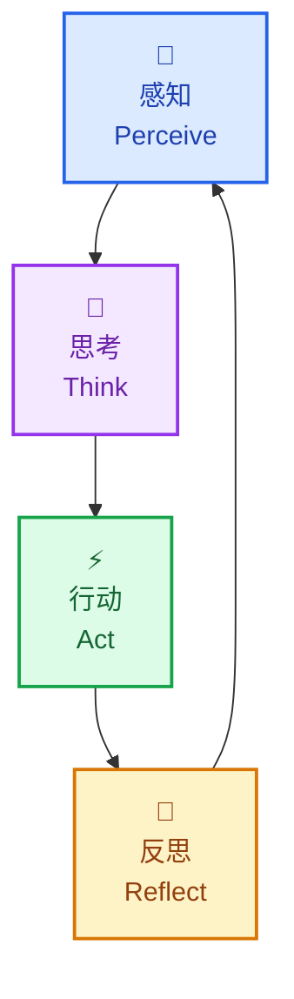
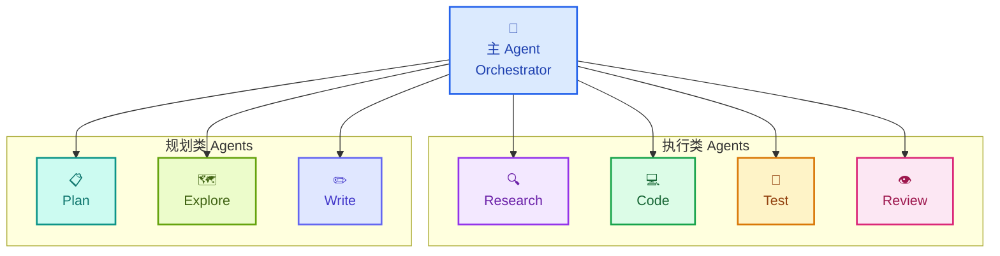
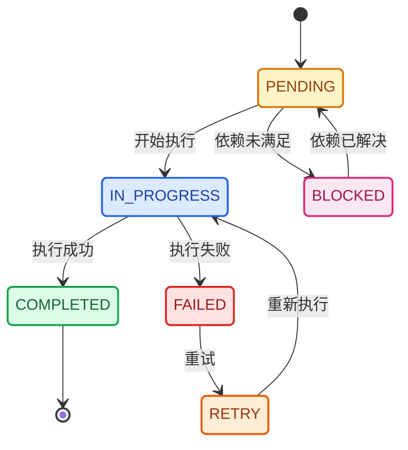
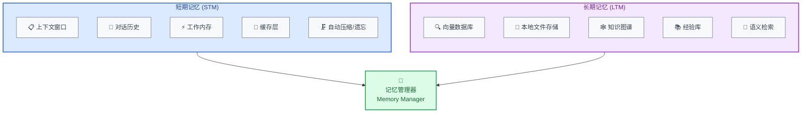
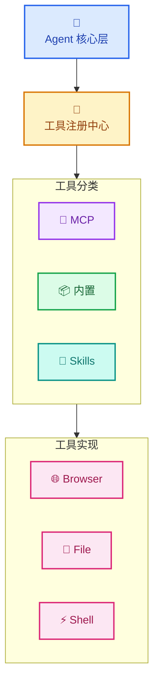
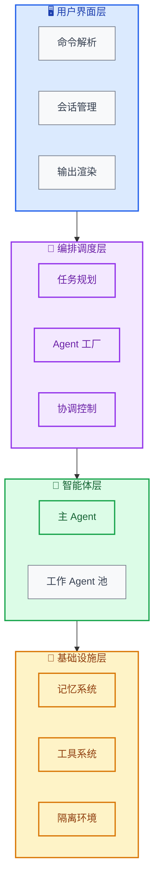

# Niuma 🐂

**下一代认知多智能体 AI 系统**

Niuma（牛马）是一个具备**认知能力**、**协作能力**和**自主执行能力**的 AI Agent 系统，能够处理复杂的多步骤任务，通过多智能体协作和反思机制持续优化执行质量。

## 核心特性

- 🧠 **深度认知**：CoT + Reflection 双循环，持续自我改进
- 🤝 **智能协作**：动态 Agent 组建，自适应任务分配
- 💾 **分层记忆**：短期/长期记忆协同，经验持续积累
- 🏝️ **任务隔离**：Worktree 级隔离，安全并发执行
- 🧩 **MCP 原生**：拥抱 MCP 生态，工具即插即用
- ⚡ **异步优先**：Python asyncio 全异步架构，高效资源利用


## 核心功能模块

### 认知架构 (Cognitive Architecture)



#### 思维链 (Chain-of-Thought)
- **任务分解**：LLM 分析用户输入，拆分为原子操作
- **依赖分析**：识别子任务间的执行顺序和依赖关系
- **执行规划**：生成带优先级的执行计划

#### 反思机制 (Reflection)
- **状态评估**：每步执行后评估是否接近目标
- **偏差检测**：检测执行路径是否偏离预期
- **策略调整**：根据反馈动态调整后续计划

### 多智能体协作系统



#### 团队协议 (Team Protocol)
```python
from dataclasses import dataclass
from typing import List, Literal

@dataclass
class AgentRole:
    name: str
    responsibilities: List[str]
    skills: List[str]
    constraints: List[str]

@dataclass
class CommunicationConfig:
    protocol: Literal['message_queue', 'direct', 'broadcast']
    priority_levels: int = 3

@dataclass
class CollaborationConfig:
    mode: Literal['sequential', 'parallel', 'hybrid']
    max_agents: int = 5

@dataclass
class TeamProtocol:
    roles: List[AgentRole]
    communication: CommunicationConfig
    collaboration: CollaborationConfig
```

#### 子 Agent 类型

| Agent 类型 | 职责 | 专长领域 |
|-----------|------|---------|
| **ResearchAgent** | 信息收集、搜索、文档阅读 | 网页搜索、代码搜索、文档解析 |
| **PlanAgent** | 任务规划、架构设计 | 系统设计、依赖分析 |
| **CodeAgent** | 代码编写、重构 | 代码生成、代码修改 |
| **TestAgent** | 测试执行、验证 | 单元测试、集成测试、性能测试 |
| **ReviewAgent** | 代码审查、质量检查 | 静态分析、最佳实践检查 |
| **ExploreAgent** | 代码库探索、理解 | 文件搜索、依赖分析 |

### 任务系统与规划

#### 任务模型
```python
from dataclasses import dataclass, field
from typing import Optional, List, Dict, Any
from datetime import datetime
from enum import Enum, auto

class TaskStatus(Enum):
    PENDING = auto()
    IN_PROGRESS = auto()
    COMPLETED = auto()
    FAILED = auto()
    BLOCKED = auto()

class TaskType(Enum):
    ATOMIC = auto()
    COMPOSITE = auto()
    SUBTASK = auto()

@dataclass
class Task:
    id: str
    type: TaskType
    status: TaskStatus = TaskStatus.PENDING

    # 执行内容
    description: str = ""
    goal: str = ""
    acceptance_criteria: List[str] = field(default_factory=list)

    # 层级关系
    parent_id: Optional[str] = None
    subtask_ids: List[str] = field(default_factory=list)
    dependencies: List[str] = field(default_factory=list)  # 前置任务ID

    # 执行配置
    assigned_to: Optional[str] = None  # Agent ID
    tools: List[str] = field(default_factory=list)
    timeout: int = 300  # 秒
    max_retries: int = 3

    # 元数据
    priority: int = 1
    created_at: datetime = field(default_factory=datetime.now)
    started_at: Optional[datetime] = None
    completed_at: Optional[datetime] = None
    metadata: Dict[str, Any] = field(default_factory=dict)
```

#### 任务状态流转



#### 并发控制
- **后台任务**：支持长时间运行的异步任务
- **任务隔离**：每个任务在独立的 Worktree/上下文中执行
- **资源限制**：控制并发 Agent 数量，防止资源耗尽

### 记忆系统



#### 短期记忆管理
- **滑动窗口**：维护最近 N 轮对话/操作
- **智能压缩**：使用 LLM 总结历史上下文
- **重要性标记**：标记关键信息，优先保留

#### 长期记忆存储
- **向量存储**：使用 embedding 进行语义检索
- **结构化存储**：项目知识、代码模式、最佳实践
- **经验学习**：记录成功/失败的执行模式

### 工具系统与 MCP 集成



#### MCP 集成
- **动态发现**：自动发现并加载 MCP 服务器
- **能力声明**：每个工具声明其输入/输出能力
- **安全沙箱**：限制工具的执行权限

#### Skill 系统
- **可复用技能**：封装常用操作序列
- **技能学习**：从执行记录中提取可复用模式
- **版本管理**：技能可以迭代更新

## 系统架构


## 快速开始

### 安装

```bash
# 克隆仓库
git clone https://github.com/Eivs/niuma.git
cd niuma

# 使用 uv 安装依赖
uv sync --all-extras
```

### 配置

1. 复制示例配置文件：

```bash
cp .env.example .env
```

2. 编辑 `.env` 文件，填入你的 API Key：

```env
# LLM 配置（二选一）
LLM_PROVIDER=openai
OPENAI_API_KEY=your-openai-api-key-here

# 或
# LLM_PROVIDER=anthropic
# ANTHROPIC_API_KEY=your-anthropic-api-key-here

# 可选：自定义模型
OPENAI_MODEL=gpt-4o
LLM_TEMPERATURE=0.7
```

详见 `.env.example` 了解所有可配置项。

### 使用

```bash
# 启动交互式 CLI
uv run niuma

# 运行单次任务
uv run niuma run "分析这个代码库的架构"

# 启动 Web API
uv run uvicorn niuma.api.main:app --reload
```

## 开发

```bash
# 代码检查
uv run ruff check niuma/
uv run ruff format niuma/
uv run mypy niuma/

# 运行测试
uv run pytest
uv run pytest --cov=niuma

# 预提交钩子
uv run pre-commit install
uv run pre-commit run --all-files
```

## 架构

```
niuma/
├── cli/          # CLI 界面
├── core/         # 核心组件（认知引擎、任务调度）
├── agents/       # Agent 实现
├── memory/       # 记忆系统
├── tools/        # 工具系统
└── skills/       # 技能系统
```

详见 [docs/PRD.md](docs/PRD.md) 了解完整架构设计。

## 许可证

MIT License
