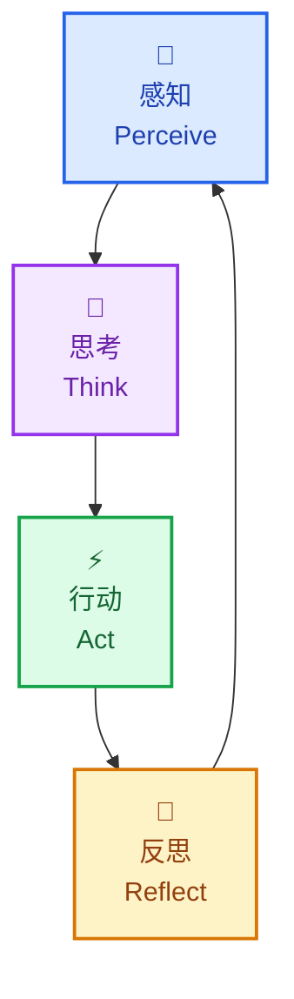
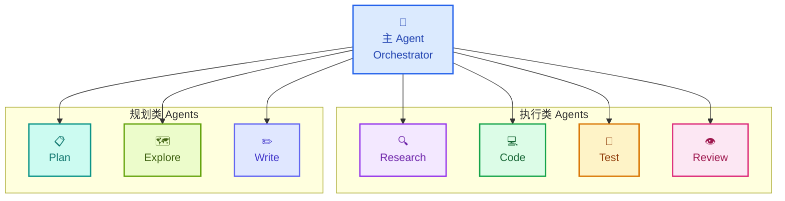
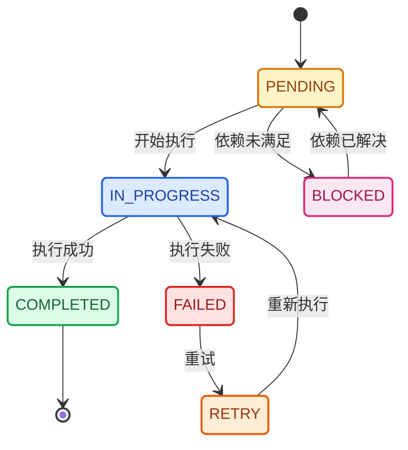
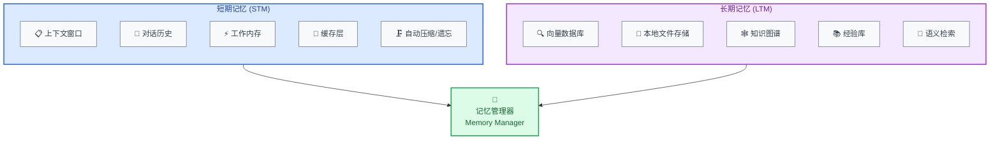
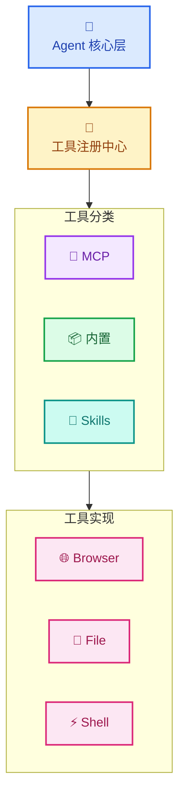
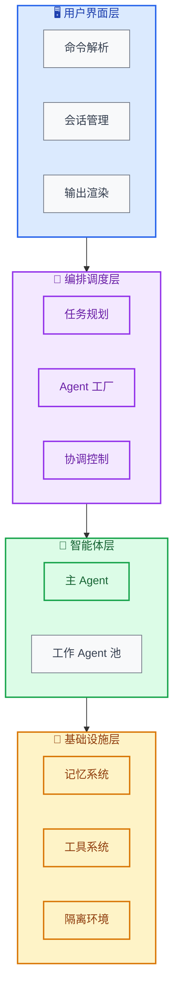
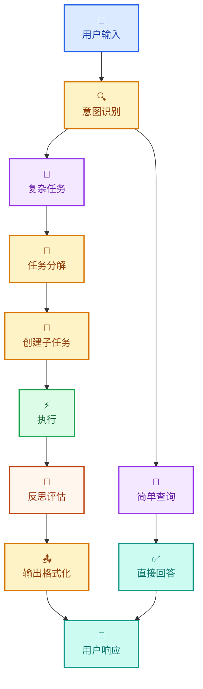

# Niuma - 创新 AI Agent 系统

## 产品需求文档 (PRD) 与架构设计

---

## 一、产品概述

### 1.1 愿景
构建一个具备**认知能力**、**协作能力**和**自主执行能力**的下一代 AI Agent 系统，能够处理复杂的多步骤任务，通过多智能体协作和反思机制持续优化执行质量。

### 1.2 核心价值主张
- **智能分解**：自动将复杂任务拆分为可执行的子任务
- **持续优化**：通过反思机制不断修正执行路径
- **高效协作**：多 Agent 并行处理，提升整体效率
- **安全隔离**：任务级隔离确保环境安全和可恢复性

---

## 二、核心功能模块

### 2.1 认知架构 (Cognitive Architecture)



#### 2.1.1 思维链 (Chain-of-Thought)
- **任务分解**：LLM 分析用户输入，拆分为原子操作
- **依赖分析**：识别子任务间的执行顺序和依赖关系
- **执行规划**：生成带优先级的执行计划

#### 2.1.2 反思机制 (Reflection)
- **状态评估**：每步执行后评估是否接近目标
- **偏差检测**：检测执行路径是否偏离预期
- **策略调整**：根据反馈动态调整后续计划

### 2.2 多智能体协作系统



#### 2.2.1 团队协议 (Team Protocol)
```python
from dataclasses import dataclass
from typing import List, Literal

@dataclass
class AgentRole:
    name: str
    responsibilities: List[str]
    skills: List[str]
    constraints: List[str]

@dataclass
class CommunicationConfig:
    protocol: Literal['message_queue', 'direct', 'broadcast']
    priority_levels: int = 3

@dataclass
class CollaborationConfig:
    mode: Literal['sequential', 'parallel', 'hybrid']
    max_agents: int = 5

@dataclass
class TeamProtocol:
    roles: List[AgentRole]
    communication: CommunicationConfig
    collaboration: CollaborationConfig
```

#### 2.2.2 子 Agent 类型

| Agent 类型 | 职责 | 专长领域 |
|-----------|------|---------|
| **ResearchAgent** | 信息收集、搜索、文档阅读 | 网页搜索、代码搜索、文档解析 |
| **PlanAgent** | 任务规划、架构设计 | 系统设计、依赖分析 |
| **CodeAgent** | 代码编写、重构 | 代码生成、代码修改 |
| **TestAgent** | 测试执行、验证 | 单元测试、集成测试、性能测试 |
| **ReviewAgent** | 代码审查、质量检查 | 静态分析、最佳实践检查 |
| **ExploreAgent** | 代码库探索、理解 | 文件搜索、依赖分析 |

### 2.3 任务系统与规划

#### 2.3.1 任务模型
```python
from dataclasses import dataclass, field
from typing import Optional, List, Dict, Any
from datetime import datetime
from enum import Enum, auto

class TaskStatus(Enum):
    PENDING = auto()
    IN_PROGRESS = auto()
    COMPLETED = auto()
    FAILED = auto()
    BLOCKED = auto()

class TaskType(Enum):
    ATOMIC = auto()
    COMPOSITE = auto()
    SUBTASK = auto()

@dataclass
class Task:
    id: str
    type: TaskType
    status: TaskStatus = TaskStatus.PENDING

    # 执行内容
    description: str = ""
    goal: str = ""
    acceptance_criteria: List[str] = field(default_factory=list)

    # 层级关系
    parent_id: Optional[str] = None
    subtask_ids: List[str] = field(default_factory=list)
    dependencies: List[str] = field(default_factory=list)  # 前置任务ID

    # 执行配置
    assigned_to: Optional[str] = None  # Agent ID
    tools: List[str] = field(default_factory=list)
    timeout: int = 300  # 秒
    max_retries: int = 3

    # 元数据
    priority: int = 1
    created_at: datetime = field(default_factory=datetime.now)
    started_at: Optional[datetime] = None
    completed_at: Optional[datetime] = None
    metadata: Dict[str, Any] = field(default_factory=dict)
```

#### 2.3.2 任务状态流转



#### 2.3.3 并发控制
- **后台任务**：支持长时间运行的异步任务
- **任务隔离**：每个任务在独立的 Worktree/上下文中执行
- **资源限制**：控制并发 Agent 数量，防止资源耗尽

### 2.4 记忆系统



#### 2.4.1 短期记忆管理
- **滑动窗口**：维护最近 N 轮对话/操作
- **智能压缩**：使用 LLM 总结历史上下文
- **重要性标记**：标记关键信息，优先保留

#### 2.4.2 长期记忆存储
- **向量存储**：使用 embedding 进行语义检索
- **结构化存储**：项目知识、代码模式、最佳实践
- **经验学习**：记录成功/失败的执行模式

### 2.5 工具系统与 MCP 集成



#### 2.5.1 MCP 集成
- **动态发现**：自动发现并加载 MCP 服务器
- **能力声明**：每个工具声明其输入/输出能力
- **安全沙箱**：限制工具的执行权限

#### 2.5.2 Skill 系统
- **可复用技能**：封装常用操作序列
- **技能学习**：从执行记录中提取可复用模式
- **版本管理**：技能可以迭代更新

---

## 三、系统架构设计

### 3.1 整体架构图



### 3.2 核心组件详解

#### 3.2.1 认知引擎 (Cognitive Core)

```python
from abc import ABC, abstractmethod
from typing import List, Dict, Any, Optional
from dataclasses import dataclass

@dataclass
class ReasoningResult:
    subtasks: List['SubTask']
    plan: 'ExecutionPlan'
    confidence: float

@dataclass
class Evaluation:
    is_on_track: bool
    deviation_score: float
    suggestions: List[str]

@dataclass
class Strategy:
    next_actions: List[str]
    adjusted_plan: Optional['ExecutionPlan'] = None

class ChainOfThought:
    def decompose(self, task: 'Task') -> List['SubTask']:
        """将任务分解为子任务"""
        pass

    def plan(self, subtasks: List['SubTask']) -> 'ExecutionPlan':
        """生成执行计划"""
        pass

    def reason(self, context: 'Context') -> ReasoningResult:
        """推理当前应该做什么"""
        pass

class Reflection:
    def evaluate(self, state: 'AgentState') -> Evaluation:
        """评估当前状态"""
        pass

    def detect_deviation(self, plan: 'Plan', actual: 'Actual') -> List['Deviation']:
        """检测执行偏差"""
        pass

    def adjust_strategy(self, evaluation: Evaluation) -> Strategy:
        """调整策略"""
        pass

class CognitiveCore:
    def __init__(self, llm_client: 'LLMClient'):
        self.llm = llm_client
        self.cot = ChainOfThought()
        self.reflection = Reflection()
        self.state: 'AgentState' = None
        self.history: List['StateTransition'] = []
        self.working_memory: 'WorkingMemory' = WorkingMemory()
```

#### 3.2.2 Agent 运行时

```python
import asyncio
from typing import Callable, Optional
from enum import Enum, auto

class AgentState(Enum):
    IDLE = auto()
    RUNNING = auto()
    PAUSED = auto()
    TERMINATED = auto()

class AgentRuntime:
    def __init__(
        self,
        agent_id: str,
        role: 'AgentRole',
        cognitive_core: CognitiveCore,
        tools: 'ToolRegistry',
        memory: 'MemoryManager'
    ):
        self.id = agent_id
        self.role = role
        self.cognitive_core = cognitive_core
        self.tools = tools
        self.memory = memory
        self.state = AgentState.IDLE
        self._task: Optional[asyncio.Task] = None
        self._pause_event = asyncio.Event()
        self._pause_event.set()  # 默认不暂停

    async def run_loop(self) -> None:
        """主执行循环"""
        self.state = AgentState.RUNNING

        while self.state != AgentState.TERMINATED:
            # 等待暂停恢复
            await self._pause_event.wait()

            # 1. 感知
            perception = await self.perceive()

            # 2. 思考
            thought = await self.think(perception)

            # 3. 行动
            action = await self.decide(thought)
            result = await self.execute(action)

            # 4. 反思
            reflection = await self.reflect(result)

            # 5. 更新状态
            await self.update_state(reflection)

    async def perceive(self) -> 'Perception':
        """感知环境"""
        pass

    async def think(self, perception: 'Perception') -> 'Thought':
        """思考决策"""
        pass

    async def decide(self, thought: 'Thought') -> 'Action':
        """决定行动"""
        pass

    async def execute(self, action: 'Action') -> 'ActionResult':
        """执行行动"""
        pass

    async def reflect(self, result: 'ActionResult') -> 'Reflection':
        """反思结果"""
        pass

    async def update_state(self, reflection: 'Reflection') -> None:
        """更新状态"""
        pass

    def pause(self) -> None:
        """暂停执行"""
        self.state = AgentState.PAUSED
        self._pause_event.clear()

    def resume(self) -> None:
        """恢复执行"""
        self.state = AgentState.RUNNING
        self._pause_event.set()

    async def terminate(self) -> None:
        """终止执行"""
        self.state = AgentState.TERMINATED
        if self._task:
            self._task.cancel()
```

#### 3.2.3 任务调度器

```python
import heapq
from typing import Set, Dict, List
from dataclasses import dataclass, field
from collections import deque

@dataclass(order=True)
class PrioritizedTask:
    priority: int
    sequence: int
    task: 'Task' = field(compare=False)

class DependencyGraph:
    def __init__(self):
        self.graph: Dict[str, Set[str]] = {}  # task_id -> dependencies
        self.reverse: Dict[str, Set[str]] = {}  # task_id -> dependents

    def add_task(self, task_id: str, dependencies: List[str]) -> None:
        self.graph[task_id] = set(dependencies)
        for dep in dependencies:
            if dep not in self.reverse:
                self.reverse[dep] = set()
            self.reverse[dep].add(task_id)

    def is_ready(self, task_id: str, completed: Set[str]) -> bool:
        return self.graph.get(task_id, set()).issubset(completed)

    def topological_sort(self) -> List[str]:
        """返回拓扑排序后的任务顺序"""
        in_degree = {task: len(deps) for task, deps in self.graph.items()}
        queue = deque([task for task, deg in in_degree.items() if deg == 0])
        result = []

        while queue:
            task = queue.popleft()
            result.append(task)
            for dependent in self.reverse.get(task, set()):
                in_degree[dependent] -= 1
                if in_degree[dependent] == 0:
                    queue.append(dependent)

        return result

class TaskScheduler:
    def __init__(self, max_concurrency: int = 5):
        self.queue: List[PrioritizedTask] = []
        self.running: Dict[str, 'Task'] = {}
        self.completed: Set[str] = set()
        self.failed: Dict[str, Exception] = {}
        self.dependency_graph = DependencyGraph()
        self.max_concurrency = max_concurrency
        self._sequence = 0

    def schedule(self, task: 'Task') -> None:
        """调度任务"""
        self.dependency_graph.add_task(task.id, task.dependencies)
        self._sequence += 1
        prioritized = PrioritizedTask(
            priority=task.priority,
            sequence=self._sequence,
            task=task
        )
        heapq.heappush(self.queue, prioritized)

    async def run(self) -> None:
        """运行调度器"""
        while self.queue or self.running:
            # 启动就绪的任务
            while len(self.running) < self.max_concurrency and self.queue:
                ready_tasks = [
                    pt for pt in self.queue
                    if self.dependency_graph.is_ready(pt.task.id, self.completed)
                ]
                if not ready_tasks:
                    break

                # 获取优先级最高的就绪任务
                ready_tasks.sort()
                prioritized = ready_tasks[0]
                self.queue.remove(prioritized)

                # 启动任务
                task = prioritized.task
                self.running[task.id] = task
                asyncio.create_task(self._execute_task(task))

            await asyncio.sleep(0.1)

    async def _execute_task(self, task: 'Task') -> None:
        """执行单个任务"""
        try:
            task.status = TaskStatus.IN_PROGRESS
            task.started_at = datetime.now()

            # 获取分配的 Agent
            agent = await self._get_agent(task)
            result = await agent.run(task)

            task.status = TaskStatus.COMPLETED
            task.completed_at = datetime.now()
            self.completed.add(task.id)

        except Exception as e:
            task.status = TaskStatus.FAILED
            self.failed[task.id] = e

        finally:
            del self.running[task.id]

    async def _get_agent(self, task: 'Task') -> 'AgentRuntime':
        """获取或创建 Agent"""
        pass
```

### 3.3 数据流设计



---

## 四、技术栈选型

### 4.1 核心语言与框架

| 层级 | 技术选型 | 理由 |
|-----|---------|------|
| **后端语言** | Python 3.11+ | 丰富的 AI/ML 生态，异步原生支持 |
| **Web 框架** | FastAPI | 高性能异步框架，自动 API 文档 |
| **LLM 框架** | LangChain / PydanticAI / 自研 | 灵活组合，建议核心流程自研 |
| **异步框架** | asyncio + anyio | Python 标准异步支持 |
| **CLI 框架** | Typer / Click | 类型友好的 CLI 构建 |
| **配置管理** | Pydantic Settings | 类型安全的配置验证 |

### 4.2 记忆存储

| 类型 | 技术 | 用途 |
|-----|------|------|
| 短期记忆 | In-memory + LRU Cache | 活跃上下文 |
| 向量存储 | ChromaDB / Qdrant | 语义检索，本地优先 |
| 图存储 | NetworkX / Neo4j | 知识关系 |
| 持久化 | SQLite / PostgreSQL | 本地经验库，结构化存储 |

### 4.3 MCP 工具集成

- **协议实现**: MCP Python SDK
- **工具发现**: 动态导入 + 注册中心
- **安全隔离**: 子进程 + 沙箱限制

---

## 五、关键接口定义

### 5.1 Agent 接口

```python
from abc import ABC, abstractmethod
from typing import Any, Dict, List, Optional, Callable
from enum import Enum, auto

class AgentState(Enum):
    """Agent 状态枚举"""
    INITIALIZING = auto()
    IDLE = auto()
    RUNNING = auto()
    PAUSED = auto()
    TERMINATED = auto()

class Message:
    """消息模型"""
    def __init__(
        self,
        sender: str,
        receiver: str,
        content: Any,
        msg_type: str = "default",
        metadata: Optional[Dict] = None
    ):
        self.sender = sender
        self.receiver = receiver
        self.content = content
        self.msg_type = msg_type
        self.metadata = metadata or {}

class TaskInput:
    """任务输入"""
    def __init__(self, task: str, context: Optional[Dict] = None, priority: int = 1):
        self.task = task
        self.context = context or {}
        self.priority = priority

class TaskOutput:
    """任务输出"""
    def __init__(
        self,
        result: Any,
        success: bool = True,
        metadata: Optional[Dict] = None
    ):
        self.result = result
        self.success = success
        self.metadata = metadata or {}

MessageHandler = Callable[[Message], None]

class IAgent(ABC):
    """Agent 接口基类"""

    @property
    @abstractmethod
    def id(self) -> str:
        """Agent 唯一标识"""
        pass

    @property
    @abstractmethod
    def role(self) -> 'AgentRole':
        """Agent 角色"""
        pass

    @property
    @abstractmethod
    def state(self) -> AgentState:
        """当前状态"""
        pass

    @abstractmethod
    async def initialize(self, config: Dict[str, Any]) -> None:
        """初始化 Agent"""
        pass

    @abstractmethod
    async def run(self, input_data: TaskInput) -> TaskOutput:
        """执行主任务"""
        pass

    @abstractmethod
    def pause(self) -> None:
        """暂停执行"""
        pass

    @abstractmethod
    def resume(self) -> None:
        """恢复执行"""
        pass

    @abstractmethod
    async def terminate(self) -> None:
        """终止 Agent"""
        pass

    @abstractmethod
    def send_message(self, to: str, message: Message) -> None:
        """发送消息"""
        pass

    @abstractmethod
    def on_message(self, handler: MessageHandler) -> None:
        """注册消息处理器"""
        pass

    @abstractmethod
    def remember(
        self,
        key: str,
        value: Any,
        memory_type: str = "short_term"
    ) -> None:
        """保存记忆"""
        pass

    @abstractmethod
    async def recall(
        self,
        query: str,
        options: Optional[Dict] = None
    ) -> List[Any]:
        """检索记忆"""
        pass
```

### 5.2 工具接口

```python
from abc import ABC, abstractmethod
from typing import Any, Dict, Optional, Callable
from pydantic import BaseModel

class ToolContext(BaseModel):
    """工具执行上下文"""
    agent_id: str
    task_id: str
    worktree_path: Optional[str] = None
    memory: Optional[Any] = None

    class Config:
        arbitrary_types_allowed = True

class ToolResult(BaseModel):
    """工具执行结果"""
    success: bool
    data: Optional[Any] = None
    error: Optional[str] = None
    metadata: Dict = {}

class ITool(ABC):
    """工具接口"""

    @property
    @abstractmethod
    def name(self) -> str:
        """工具名称"""
        pass

    @property
    @abstractmethod
    def description(self) -> str:
        """工具描述"""
        pass

    @property
    @abstractmethod
    def parameters(self) -> Dict:
        """参数 JSON Schema"""
        pass

    @property
    @abstractmethod
    def returns(self) -> Dict:
        """返回值 JSON Schema"""
        pass

    @abstractmethod
    async def execute(
        self,
        params: Dict[str, Any],
        context: ToolContext
    ) -> ToolResult:
        """执行工具"""
        pass

    def validate(self, params: Dict[str, Any]) -> bool:
        """验证参数（可选覆盖）"""
        return True
```

### 5.3 任务接口

```python
from abc import ABC, abstractmethod
from typing import Callable, Optional, Any
from enum import Enum, auto

class TaskStatus(Enum):
    """任务状态"""
    PENDING = auto()
    IN_PROGRESS = auto()
    COMPLETED = auto()
    FAILED = auto()
    CANCELLED = auto()

class TaskResult:
    """任务结果"""
    def __init__(
        self,
        task_id: str,
        status: TaskStatus,
        output: Optional[Any] = None,
        error: Optional[str] = None
    ):
        self.task_id = task_id
        self.status = status
        self.output = output
        self.error = error

StatusHandler = Callable[['ITask', TaskStatus], None]

class ITask(ABC):
    """任务接口"""

    @property
    @abstractmethod
    def id(self) -> str:
        """任务 ID"""
        pass

    @property
    @abstractmethod
    def parent_id(self) -> Optional[str]:
        """父任务 ID"""
        pass

    @abstractmethod
    async def execute(self, executor: 'IAgent') -> TaskResult:
        """执行任务"""
        pass

    @abstractmethod
    def cancel(self) -> None:
        """取消任务"""
        pass

    @abstractmethod
    def get_status(self) -> TaskStatus:
        """获取状态"""
        pass

    @abstractmethod
    def on_status_change(self, handler: StatusHandler) -> None:
        """注册状态变更处理器"""
        pass

    @abstractmethod
    def add_dependency(self, task_id: str) -> None:
        """添加依赖"""
        pass

    @abstractmethod
    def check_dependencies(self, completed: set) -> bool:
        """检查依赖是否满足"""
        pass
```

---

## 六、项目结构

```
niuma/
├── niuma/                     # 核心包
│   ├── __init__.py
│   ├── cli/                   # CLI 界面
│   │   ├── __init__.py
│   │   ├── main.py
│   │   └── commands/
│   ├── core/                  # 核心组件
│   │   ├── __init__.py
│   │   ├── agent.py           # Agent 基类
│   │   ├── cognitive.py       # 认知引擎
│   │   ├── task.py            # 任务模型
│   │   └── scheduler.py       # 任务调度器
│   ├── agents/                # Agent 实现
│   │   ├── __init__.py
│   │   ├── orchestrator.py    # 主 Agent
│   │   ├── research.py        # 研究 Agent
│   │   ├── code.py            # 代码 Agent
│   │   ├── test.py            # 测试 Agent
│   │   └── review.py          # 审查 Agent
│   ├── memory/                # 记忆系统
│   │   ├── __init__.py
│   │   ├── short_term.py      # 短期记忆
│   │   ├── long_term.py       # 长期记忆
│   │   ├── vector_store.py    # 向量存储
│   │   └── manager.py         # 记忆管理器
│   ├── tools/                 # 工具系统
│   │   ├── __init__.py
│   │   ├── registry.py        # 工具注册中心
│   │   ├── mcp/               # MCP 工具
│   │   └── builtin/           # 内置工具
│   ├── skills/                # 技能系统
│   │   ├── __init__.py
│   │   └── manager.py
│   ├── protocol/              # 团队协议
│   │   ├── __init__.py
│   │   └── team.py
│   ├── isolation/             # 隔离系统
│   │   ├── __init__.py
│   │   └── worktree.py
│   └── config.py              # 配置管理
├── tests/                     # 测试
├── docs/                      # 文档
├── examples/                  # 示例
├── pyproject.toml             # 项目配置
└── README.md
```

---

## 七、实现阶段规划

### 阶段一：核心框架 (Week 1-2) ✅
- [x] 项目脚手架搭建 (pyproject.toml + 基础结构)
- [x] Agent 运行时基础架构
- [x] 认知引擎（CoT + Reflection）
- [x] 基础 CLI 界面 (Typer)
- [x] 简单工具集成

### 阶段二：任务系统 (Week 3-4) ✅
- [x] 任务调度器实现
- [x] 子任务分解算法
- [x] 并发执行控制 (asyncio)
- [x] Worktree 隔离 (GitPython)

### 阶段三：多智能体 (Week 5-6) ✅
- [x] Agent 工厂
- [x] 团队协议实现
- [x] 子 Agent 通信 (消息队列)
- [x] 结果聚合策略

### 阶段四：记忆系统 (Week 7-8) ✅
- [x] 短期记忆管理
- [x] 长期记忆存储 (ChromaDB)
- [x] 向量检索实现
- [x] 记忆压缩算法

### 阶段五：MCP 与技能 (Week 9-10) ✅
- [x] MCP 客户端集成
- [x] 工具动态发现
- [x] Skill 系统设计
- [x] 技能学习机制

### 阶段六：优化与扩展 (Week 11-12) ✅
- [x] 性能优化
- [x] Web API (FastAPI)
- [x] 测试覆盖 (pytest)
- [x] 文档完善

---

## 八、设计原则

1. **模块化**：各组件独立演进，清晰的接口边界
2. **可观测性**：全程日志、状态可视化、执行追踪
3. **可恢复性**：任务状态持久化，支持断点续传
4. **安全性**：Worktree 隔离、权限控制、沙箱执行
5. **可扩展性**：插件化架构，支持自定义 Agent 和工具

---

## 九、差异化亮点

| 特性 | 说明 |
|-----|------|
| 🧠 **深度认知** | CoT + Reflection 双循环，持续自我改进 |
| 🤝 **智能协作** | 动态 Agent 组建，自适应任务分配 |
| 💾 **分层记忆** | 短期/长期记忆协同，经验持续积累 |
| 🏝️ **任务隔离** | Worktree 级隔离，安全并发执行 |
| 🧩 **MCP 原生** | 拥抱 MCP 生态，工具即插即用 |
| ⚡ **异步优先** | Python asyncio 全异步架构，高效资源利用 |

---

## 十、关键依赖

```toml
[project]
name = "niuma"
version = "0.1.0"
description = "A cognitive multi-agent AI system"
requires-python = ">=3.11"
dependencies = [
    # 核心框架
    "pydantic>=2.0",
    "pydantic-settings>=2.0",
    "anyio>=4.0",

    # CLI
    "typer>=0.9",
    "rich>=13.0",

    # LLM
    "openai>=1.0",
    "anthropic>=0.20",
    "langchain>=0.1",

    # 记忆存储
    "chromadb>=0.4",
    "sqlalchemy>=2.0",
    "aiosqlite>=0.20",

    # MCP
    "mcp>=1.0",

    # 工具
    "GitPython>=3.1",
    "aiofiles>=23.0",
    "httpx>=0.27",

    # 配置
    "pyyaml>=6.0",
    "toml>=0.10",
]

[project.optional-dependencies]
dev = [
    "pytest>=8.0",
    "pytest-asyncio>=0.23",
    "pytest-cov>=5.0",
    "black>=24.0",
    "ruff>=0.4",
    "mypy>=1.9",
    "pre-commit>=3.7",
]
web = [
    "fastapi>=0.110",
    "uvicorn[standard]>=0.29",
]
```

---

这份文档基于 Python 后端技术栈进行了全面调整，涵盖了从核心架构到具体实现的完整设计。需要我详细展开某个模块的实现细节吗？
